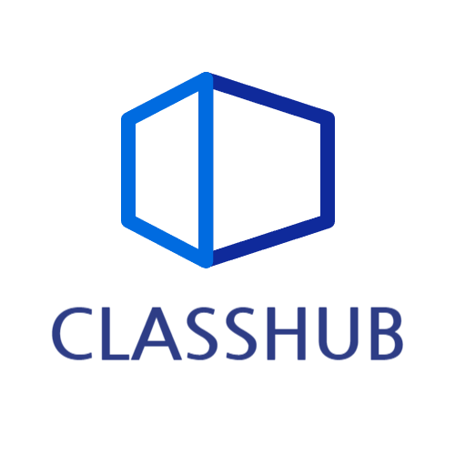

# Classhub \_ 온라인 학습시스템

> ## ✔ 개발인원 , 개발기간 및 역할

    개발인원 : 총 4명 (프론트엔드 1명, 백엔드 3명)

    역할 담당 : 프론트엔드 담당(팀장), 기여도 (35%)

    개발기간 : 2024.05.01 ~ 2024.06.18

 

> ## ✍ 사용된 기술 스택

### Front-End

 

### ETC

 

> ## 🖐 프로젝트 소개

**클래스허브** 는 언제 어디서나 접근 가능한 온라인 학습 플랫폼으로 다양한 프로그래밍 주제와 전문가 강의를 통해 학생들에게 편리하고 효율적인 학습 경험을 제공합니다.

개발자로 성장하는 과정에서 독학으로 여러 학습 시스템을 활용한 경험이 많은 저는   인프런이나 유데미 등 학습 플랫폼에서 제공되는 영상 이어보기, 학습 현황 추적 기능을 직접 구현해 보고   또한 학습자들과 소통할 수있는 기능과 특히 독학자를 위한 스터디 모집 기능을 구현해보면
좋을 것 같다는 생각이 들어서,  효율적인 학습 환경을 구현해보고자 프로젝트를 기획하게 되었습니다.

 

<!--  -->

> ## ✨ 프로젝트 핵심 기능

1. 커뮤니티의 질문답변 및 스터디 모집 글 등록, 댓글 등록

2. 강사권한으로 강의 업로드

3. 강의 장바구니 관리 기능

4. PortOne을 활용한 결제 및 결제내역 조회 기능

5. 사용자의 프로필관리 및 권한 설정
    

> ## ⭐ 프로젝트 기여도

1.  **프로젝트 기획 및 디자인 구성**

    - Figma를 활용하여 화면정의서, 와이어프레임,메뉴 구조도, TaskFlow를 제작하였습니다

2.  **유저관련 기능 구현**

    - 소셜로그인 (Google) 으로 회원가입 및 로그인 시 발급받는 JWT 토큰을 쿠키로 관리 하며, 유저정보는 `ContextAPI` 를 사용하여 전역적으로 관리

3.  **PortOne을 활용하여 강의 결제 및 결제내역 조회 구현**

    - 강의 바로신청 및 장바구니 결제 시, 물품 정보와 금액 정보를 DB로 전달하는 API를 호출하여 사전 결제 금액을 확인하고, 이와 동일하다면 결제를 가능하게 구현했습니다.  결제가 성공하면 반환된 imp_Uid를 참조하여 결제 내역을 조회하고 출력하도록 구현

4.  **강의 업로드 페이지 구현**

    - 비디오 업로드를 위해 이중 배열로 구성하여 각 섹션별로 저장하고, 강의 제목, 가격 등의 정보를 JSON 형식으로 formData에 추가 한 후, 강의 업로드시 multipart/formData 형식 으로 POST 요청하도록 기능을 구현

5.  **localStorage를 사용하여 영상 이어듣기 구현**
    - 사용자가 영상을 시청할 때 localStorage에 영상 정보를 저장하여, 추후에 재시청할 때 localStorage의 정보를 참조하여 영상을 이어서 들을 수 있도록 구현

 

> ## 💫 트러블 슈팅

## 커뮤니티 댓글목록 사용자 경험 향상

### [문제점]

커뮤니티 게시글에 댓글을 작성할 때 화면이 즉시 업데이트되지 않고, 댓글 데이터를 업데이트하는 API 호출 시 화면이 리렌더링되면서 깜빡거리는 문제가 발생하여 사용자 경험이 저하되었습니다.

### [해결방안]

React-Query의 Mutation을 활용하여 댓글 작성 시 댓글 목록이 실시간으로 업데이트되도록 낙관적 업데이트를 적용하여, 화면 깜빡임을 최소화하고 사용자 경험을 향상시킬 수 있습니다

 
 

## 스프링 시큐리티를 적용 및 배포 후 CORS 에러 발생

### [문제점]

로컬에서 작업할 때는 CORS 에러가 발생하지 않았으나, 스프링 시큐리티 및 배포작업을 마치고난 뒤 로컬에서도 CORS 에러가 발생

### [중간과정]

회의 결과, 배포하기 전에는 Access-Control-Allow-Origin에 localhost를 적용하여 CORS 오류가 발생하지 않았습니다. 그러나 배포 후 동일한 설정을 적용했음에도 불구하고 접근이 허용되지 않았습니다. 또한 스프링 시큐리티가 추가되면서 문제 발생 지점을 찾기 위해 많은 시간이 필요할 것으로 예상 된다고 전달 받았습니다.

### [해결방안]

CORS 오류로 인해 모든 API 호출이 차단되어 아무 작업도 할 수 없는 상황을 해결하기 위해 http-proxy-middleware 라이브러리를 사용하여 프록시를 설정하여 CORS 문제를 해결했습니다

### [회고]

이번 프로젝트에서 API에 매우 의존적인 프로젝트는 CORS 오류가 발생하면 아무 작업도 할 수 없다는 점을 실감했습니다. 이런 상황을 해결하기 위해 `Mock Service Worker`의 필요성을 느꼈고, 이를 대비하여 미리 Mock 데이터를 활용할 수 있는 방법에 대해 공부해야겠다고 결심했습니다.

 
 

## 강의 시청페이지 데이터 호출시 파일을 불러올 수 없음

### [문제점]

강의 데이터 호출시 썸네일과 영상 데이터 url을 가져왔으나, url을 참조하면 데이터가 출력되지않았다.  
강의 탭에서는 썸네일도 불러오지 못하고, 영상 시청페이지에서도 해당 url로 영상이 출력되지않았다. 
커뮤니티의 이미지 post, get 방식과 동일하였으나, 강의쪽에서만 문제가 발생하였다.

### [문제 해결을 위해 시도한 방법]

1. 프론트엔드쪽 문제인 것 같아 강의 썸네일도 커뮤니티의 이미지를 불러오는 방식으로 변경해보았고,  영상은 react player가 아닌 일반 html 태그인 video 태그도 활용해보았지만 출력이 되지않았다.

2. 데이터를 호출하였을때 전달 받은 url을 브라우저 주소창에 입력하였을 때, 커뮤니티 이미지 url은 이미지를 잘 보여주었으나,   강의 썸네일 이미지 url을 입력하였을 때는 아무일도 일어나지않았다.

3. 백엔드팀들과 화면공유로 강의 등록시 데이터가 제대로 전달되는지 실시간으로 확인하였다.  
   확인결과 `데이터는 제대로 전달되는 것으로 확인`되었으나, 백엔드쪽에서 `ubuntu`에 저장하는 과정에서 문제가 발생한 것으로 확인되었다.

### [해결 실패]

결론적으로는 해당 문제를 해결하지 못하였다.  
백엔드팀들과 계속 이야기하였으나, 영상은 다른 이유가 있다하더라도,  
강의정보의 썸네일은 커뮤니티 이미지를 저장하고 불러오는 방식과 똑같기때문에 출력되어야했으나, 데이터가 출력되지않았다.  

### [결과]

`ubuntu` 저장과정에서 발생하는 문제라 프론트 입장에서 더 이상 도움을 줄 수 있는 방법이 없었다.
결국 프로젝트 마감기간 동안 해당 문제를 해결하지 못하였다.

차선책으로 프론트엔드 로컬환경에서 `localStorage`를 통하여 영상 이어듣기를 구현해 보았다.

영상 데이터를 불러와서 실시간으로 영상 정보를 주고받는 기능을 구현하지 못하여 아쉬웠지만,   `localStroage`를 통해서도 이어듣기를 구현할 수 있던 것에 만족하였다.

### [향후 계획]

이번 문제를 통해 또 다시 `Mock Service Worker`의 필요성을 깨달았다.

API 의존도가 높은 프로젝트에서 `CORS에러`와 유사하듯이 백엔드팀에서 이슈가 발생하게되면 프론트엔드 입장에서 아무것도 할 수 없는 상태가 되어 무력했었다.

앞으로 비슷한 문제가 다시 발생하게 된다면, `Mock Service Worker`를 활용하여 간접적으로 API 통신 및 기능을 구현하기 위해,  추후 `Mock Service Worker`에 대해서 반드시 공부할 예정이다.

 
 

> ## 📷 화면구성
>
> **배포사이트가 없는 관계로 스크린샷과 gif 파일로 대신 첨부합니다** >   > _gif 파일이 아닌경우는 화면이 보이지않을 정도로 화질이 좋지않아 사진으로 대신합니다_

 

## 메인페이지

## pc - 강의 탭, 커뮤니티 탭, 장바구니

 

<!-- 

 -->

## 모바일 버전 - 강의 탭, 커뮤니티 탭, 장바구니

 

 

 

## 커뮤니티 글 작성 조회 및 댓글

## 강의 결제 기능

 
 

> ## 💭 회고

이번 프로젝트에서는 React에 `TypeScript`를 추가하여 프로젝트를 진행했습니다.
 
TypeScript는 코드 작성 과정에서 타입을 명시함으로써 오류를 사전에 확인할 수 있어 개발 과정의 안전성을 높여준다는 점에서 유용했습니다.

프로젝트 인원이 부족한 관계로 빠른 스타일링을 위해 `TailwindCSS`를 사용했습니다.  간단한 클래스명 기반 스타일링과 반응형 웹 구현이 편리하여 매우 유용했습니다.

API 의존도가 높은 이번 프로젝트에서는 커뮤니티 기능과 장바구니 기능이 포함되어 있어 사용자 경험 향상을 위해 `React-Query`를 선택했습니다.    `React-Query` 하나로 로딩 처리와 에러 처리를 동시에 할 수 있어 편리했으며, `Mutation`을 사용해 낙관적 업데이트를 적용하고 `prefetch`를 통해 로딩 시간을 줄여 사용자 경험을 개선할 수 있었습니다.

TypeScript는 타입 명시의 까다로움이 있지만 사전에 오류를 방지할 수 있어 좋았고,
  TailwindCSS는 스타일링 작업을 빠르게 진행할 수 있어 유용했습니다.
  React-Query는 러닝 커브가 높았지만 다양한 기능을 통해 사용자 경험을 크게 향상시킬 수 있었습니다.
